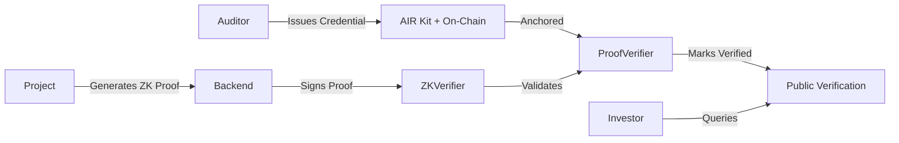

<div align="center">

# 🔐 zkVerify

### Privacy-Preserving Audit Verification Layer for Moca Chain

[](https://opensource.org/licenses/MIT)
[](https://soliditylang.org/)
[](https://nextjs.org/)
[](https://hardhat.org/)

**Prove your smart contracts have been audited without revealing sensitive report details**

[Live Demo](https://zk-verify.vercel.app) • [Documentation](#-documentation) • [Quick Start](#-quick-start) • [Architecture](#-architecture)

</div>

---

## 🌟 Overview

zkVerify is a production-ready protocol that enables **privacy-preserving audit verification** on Moca Chain. Auditors issue verifiable credentials, projects generate zero-knowledge proofs, and investors verify audit status—all while keeping sensitive vulnerability details private.

### ✨ Key Features

🔒 **Privacy-Preserving** - Prove audit completion without revealing report details  
⛓️ **On-Chain Verification** - Cryptographic proof validation via ZKVerifier contract  
🎯 **Auditor Trust Layer** - Reputation scoring from GitHub, Code4rena, Immunefi  
📊 **Real-Time Metrics** - Transparent dashboard with proof latency and gas usage  
🔐 **Secure Authentication** - EIP-191 signatures + JWT for admin operations  
🚀 **Production Ready** - Deployed on Moca Testnet with full CI/CD pipeline

---

## 🎯 Problem & Solution

### The Problem
- Audit reports contain sensitive vulnerability details
- Projects can't prove audits without exposing security weaknesses
- Investors lack trustless verification mechanisms
- No standardized auditor credibility system

### Our Solution




1. **Auditors** issue credentials via AIR Kit with only summary hashes on-chain
2. **Projects** generate ZK proofs to prove audit completion privately
3. **Smart Contracts** validate proofs cryptographically before verification
4. **Investors** verify audit status instantly using wallet addresses

---

## 🏗️ Architecture

### Smart Contracts (Solidity 0.8.20)

#### 📋 AuditorRegistry.sol
Manages approved auditors with credibility tracking
- Admin-gated auditor approval/revocation
- Profile management (GitHub, Code4rena, Immunefi)
- Credibility score updates (0-100 scale)
- Credential count tracking

#### 🔐 ZKVerifier.sol
Validates prover-signed zero-knowledge proof attestations
- EIP-191 signature verification
- Trusted prover model
- Gas usage metrics
- Proof replay prevention

#### ✅ ProofVerifier.sol
Anchors credentials and records verification status
- Credential issuance with signature validation
- ZK proof verification integration
- Project verification tracking
- Auditor-project mapping

### Backend (Node.js/Express)

**Core Services:**
- 🎫 **Credential Store** - In-memory + file-based storage
- 📊 **Metrics Service** - Proof generation/verification tracking
- 🏆 **Reputation Service** - Multi-platform reputation aggregation
- 🔍 **Contract Detector** - Automatic address extraction from work history
- 🔐 **Admin Auth** - EIP-191 + JWT authentication

**API Endpoints:**
```
POST   /api/admin/login              # Admin authentication
POST   /api/admin/approve-auditor    # Approve auditor
GET    /api/auditors                 # List all auditors
GET    /api/auditors/:address        # Get auditor details
POST   /api/apply                    # Submit auditor application
POST   /api/issueCredential          # Issue credential
POST   /api/proofs/generate          # Generate ZK proof
POST   /api/verifyProof              # Submit proof for verification
GET    /metrics                      # Real-time metrics
```

### Frontend (Next.js 14)

**Pages:**
- 🏠 **Home** - Landing page with features
- 📝 **Apply** - Auditor application form
- 👨‍💼 **Admin** - Application approval dashboard
- 🎫 **Auditor** - Credential issuance interface
- 🏆 **Reputation** - Auditor reputation display
- 📦 **Project** - Proof generation & verification
- ✅ **Verify** - Public verification interface
- 📊 **Metrics** - Real-time performance dashboard

---

## 🚀 Quick Start

### Prerequisites
- Node.js 18+
- MetaMask or compatible Web3 wallet
- Moca Chain Testnet RPC access

### Installation

```bash
# Clone repository
git clone https://github.com/ayushsaklani-min/ZkVerify.git
cd ZkVerify

# Install all dependencies
npm run install:all

# Copy environment template
cp .env.example .env
# Edit .env with your configuration
```

### Environment Setup

```bash
# Blockchain Configuration
RPC_URL=https://testnet-rpc.mocachain.org
DEPLOYER_PRIVATE_KEY=your_private_key
ADMIN_PRIVATE_KEY=your_admin_key
PROOF_SIGNER_PRIVATE_KEY=your_proof_signer_key

# Contract Addresses (after deployment)
AUDITOR_REGISTRY_ADDRESS=0x...
PROOF_VERIFIER_ADDRESS=0x...
ZK_VERIFIER_ADDRESS=0x...

# Frontend Configuration
NEXT_PUBLIC_RPC_URL=https://testnet-rpc.mocachain.org
NEXT_PUBLIC_CHAIN_ID=222888
NEXT_PUBLIC_BACKEND_URL=http://localhost:10000
```

### Development

```bash
# Compile contracts
npm run compile

# Run tests
npm test

# Deploy contracts (Moca Testnet)
npm run deploy:upgraded

# Start backend (port 10000)
npm run backend:dev

# Start frontend (port 3000)
npm run frontend:dev
```

### Local Testing

```bash
# Terminal 1: Start local Hardhat node
npx hardhat node

# Terminal 2: Deploy contracts
npx hardhat run scripts/deployUpgraded.js --network localhost

# Terminal 3: Start backend
cd backend && npm run dev

# Terminal 4: Start frontend
cd frontend && npm run dev
```

**Access:**
- Frontend: http://localhost:3000
- Backend API: http://localhost:10000
- Metrics: http://localhost:10000/metrics

---

## 📖 Documentation

### System Flow

#### 1️⃣ Auditor Onboarding
```
Application → Admin Review → On-Chain Approval → 
Reputation Fetch → Credibility Score → Credential Issuance
```

#### 2️⃣ Credential Issuance
```
Auditor Signs Summary → AIR Kit Credential → 
On-Chain Anchoring → Credential Count Update
```

#### 3️⃣ Proof Generation
```
Project Requests → Backend Generates Proof → 
Signs with Trusted Prover → Returns Proof Data
```

#### 4️⃣ Verification
```
Project Submits Proof → Contract Validates → 
ZKVerifier Checks Signature → Project Marked Verified
```

### Reputation System

**Credibility Score (0-100):**
- **GitHub** (0-35): Contributions × 0.5 + Audit Repos × 4
- **Code4rena** (0-30): HIGH × 6 + MEDIUM × 3 + Findings × 1
- **Immunefi** (0-20): Submissions × 5
- **On-Chain** (0-10): Credentials × 2
- **Tenure** (0-5): Months Active (max 5)

**Credibility Levels:**
- 🌱 New: 0-199
- 🌿 Emerging: 200-399
- 🌳 Experienced: 400-599
- 🏆 Expert: 600-799
- 👑 Elite: 800-1000

### Security Features

✅ **Smart Contract Security:**
- Access control modifiers
- Input validation
- Signature verification (EIP-191)
- Proof replay prevention
- Safe math operations

✅ **Backend Security:**
- Helmet middleware
- CORS whitelist
- Rate limiting (100 req/15min)
- JWT tokens (30min expiration)
- Private key validation

✅ **Frontend Security:**
- Environment variable isolation
- Wallet signature verification
- Transaction confirmation
- Error handling

---

## 🧪 Testing

### Smart Contract Tests

```bash
# Run all tests
npm test

# Run specific test
npx hardhat test tests/AuditorRegistry.test.js

# With gas reporting
REPORT_GAS=true npx hardhat test

# With coverage
npx hardhat coverage
```

**Test Coverage:**
- ✅ AuditorRegistry: 20+ tests
- ✅ ProofVerifier: 15+ tests
- ✅ ZKVerifier: 2+ tests
- ✅ Integration tests included

### Backend Tests

```bash
cd backend
npm test
```

---

## 📊 Performance Metrics

**Target Performance:**
- ⚡ Proof Generation: <3 seconds
- ⛽ Verification Gas: <300,000 gas
- ✅ Success Rate: >95%

**Metrics Dashboard:**
```bash
curl http://localhost:10000/metrics
```

**Response:**
```json
{
  "proofGeneration": {
    "count": 150,
    "averageMs": 2450.5,
    "medianMs": 2380.0
  },
  "proofVerification": {
    "count": 145,
    "averageGas": 285000,
    "successRate": 97.24
  }
}
```

---

## 🌐 Live Deployment

### Production URLs
- **Frontend:** [https://zk-verify.vercel.app](https://zk-verify.vercel.app)
- **Backend:** [https://zkverify-backend.onrender.com](https://zkverify-backend.onrender.com)
- **Network:** Moca Chain Testnet (Chain ID: 222888)
- **Explorer:** [https://testnet-scan.mocachain.org](https://testnet-scan.mocachain.org)

### Contract Addresses (Testnet)
```
AuditorRegistry: 0x3933E40028ca7DF666e71Fbb68232be04C499F61
ProofVerifier:   0xC988cbc4E9120d8Fd970648F0B93E90c99392ab0
Deployer:        0x48E8750b87278227b5BBd53cae998e6083910bd9
```

---

## 🛠️ Tech Stack

| Component | Technology |
|-----------|-----------|
| **Smart Contracts** | Solidity 0.8.20, Hardhat |
| **Frontend** | Next.js 14, React 18, Tailwind CSS |
| **Web3** | Wagmi 2.0, Ethers.js 6.8, Viem 2.0 |
| **Backend** | Node.js, Express.js, JWT |
| **UI Components** | Radix UI, Framer Motion, Lucide Icons |
| **Forms** | React Hook Form, Zod |
| **State** | TanStack React Query |
| **Charts** | Recharts |
| **Credentials** | AIR Kit SDK 1.6.0 |
| **Testing** | Hardhat, Chai, Jest |
| **Security** | Slither, Helmet |
| **Deployment** | Vercel, Render |

---

## 📁 Repository Structure

```
zkVerify/
├── contracts/              # Smart contracts
│   ├── AuditorRegistry.sol
│   ├── ProofVerifier.sol
│   └── ZKVerifier.sol
├── scripts/               # Deployment scripts
│   ├── deploy.js
│   └── deployUpgraded.js
├── tests/                 # Contract tests
│   ├── AuditorRegistry.test.js
│   ├── ProofVerifier.test.js
│   └── ZKVerifier.test.js
├── backend/               # Express.js API
│   ├── routes/           # API routes
│   ├── services/         # Business logic
│   ├── middleware/       # Auth & validation
│   ├── automation/       # Cron jobs
│   └── server.js         # Main server
├── frontend/              # Next.js 14 app
│   ├── app/              # App Router pages
│   ├── src/
│   │   ├── components/   # React components
│   │   ├── lib/          # Utilities
│   │   ├── abi/          # Contract ABIs
│   │   └── config.js     # Configuration
│   └── public/           # Static assets
├── security/              # Security artifacts
│   ├── slither.config.json
│   └── slither-report.json
├── .github/
│   └── workflows/        # CI/CD pipelines
├── hardhat.config.js     # Hardhat config
├── package.json          # Root dependencies
└── README.md             # This file
```

---

## 🔄 CI/CD Pipeline

### GitHub Actions Workflows

**CI Workflow:**
- ✅ Contract compilation
- ✅ Unit tests (Hardhat + Jest)
- ✅ Static analysis (Slither)
- ✅ Coverage reports
- ✅ Linting

**Deployment Workflow:**
- 🚀 Automatic Vercel deployment on push to main
- 🔄 Backend deployment to Render
- 📦 Artifact uploads

---

## 🤝 Contributing

We welcome contributions! Here's how to get started:

### Development Workflow

1. **Fork the repository**
2. **Create a feature branch**
   ```bash
   git checkout -b feature/amazing-feature
   ```
3. **Make your changes**
4. **Run tests**
   ```bash
   npm test
   ```
5. **Commit with conventional commits**
   ```bash
   git commit -m "feat: add amazing feature"
   ```
6. **Push and create PR**
   ```bash
   git push origin feature/amazing-feature
   ```

### Commit Convention

```
feat: New feature
fix: Bug fix
docs: Documentation changes
style: Code style changes
refactor: Code refactoring
test: Test additions/updates
chore: Maintenance tasks
```

### Code Standards

- Follow existing code style
- Add comments for complex logic
- Write tests for new features
- Update documentation
- Ensure all tests pass

---

## 🔐 Security

### Reporting Security Issues

**DO NOT** open public issues for security vulnerabilities.

Email: **security@zkverify.io**

### Security Measures

- ✅ Static analysis with Slither
- ✅ Comprehensive test coverage
- ✅ EIP-191 signature verification
- ✅ Rate limiting and input validation
- ✅ Regular dependency updates

### Audit Status

- **Slither Analysis:** ✅ Completed
- **Manual Review:** ✅ In Progress
- **Bug Bounty:** 🔜 Coming Soon

---

## 🗺️ Roadmap

### Phase 1: Foundation ✅
- [x] Smart contract development
- [x] Backend API implementation
- [x] Frontend development
- [x] Testing & security analysis
- [x] Testnet deployment

### Phase 2: Enhancement 🚧
- [ ] Real ZK proof system (Groth16/PLONK)
- [ ] Multi-sig admin operations
- [ ] Enhanced metrics dashboard
- [ ] Mobile-responsive improvements
- [ ] Additional reputation sources

### Phase 3: Scale 🔜
- [ ] Mainnet deployment
- [ ] Cross-chain support
- [ ] Decentralized governance
- [ ] Mobile app
- [ ] Bug bounty program

---

## 📜 License

This project is licensed under the **MIT License** - see the [LICENSE](LICENSE) file for details.

```
MIT License

Copyright (c) 2025 zkVerify Team

Permission is hereby granted, free of charge, to any person obtaining a copy
of this software and associated documentation files (the "Software"), to deal
in the Software without restriction, including without limitation the rights
to use, copy, modify, merge, publish, distribute, sublicense, and/or sell
copies of the Software, and to permit persons to whom the Software is
furnished to do so, subject to the following conditions:

The above copyright notice and this permission notice shall be included in all
copies or substantial portions of the Software.
```

---

## 🙏 Acknowledgments

- **Moca Chain** - For the buildathon and testnet infrastructure
- **AIR Kit** - For verifiable credential infrastructure
- **OpenZeppelin** - For secure smart contract libraries
- **Hardhat** - For development environment
- **Vercel & Render** - For hosting infrastructure

---

## 📞 Contact & Links

<div align="center">

### 🔗 Quick Links

[](https://zk-verify.vercel.app)
[](https://github.com/ayushsaklani-min/ZkVerify)
[](https://twitter.com/zkverify)
[](https://discord.gg/zkverify)

### 📧 Get in Touch

**General Inquiries:** [GitHub Issues](https://github.com/ayushsaklani-min/ZkVerify/issues)  
**Security:** security@zkverify.io  
**Partnerships:** partnerships@zkverify.io

---

### ⭐ Star us on GitHub!

If you find zkVerify useful, please consider giving us a star ⭐

**Built with ❤️ for Moca Buildathon 2025**

</div>

---

<div align="center">

### 🎯 Why zkVerify?

| Feature | zkVerify | Traditional Audits |
|---------|----------|-------------------|
| **Privacy** | ✅ ZK Proofs | ❌ Public Reports |
| **Verification** | ✅ On-Chain | ❌ Off-Chain Claims |
| **Auditor Trust** | ✅ Reputation Score | ❌ Manual Vetting |
| **Transparency** | ✅ Real-Time Metrics | ❌ Limited Visibility |
| **Automation** | ✅ Smart Contracts | ❌ Manual Process |

**zkVerify: The Future of Audit Verification** 🚀

</div>
