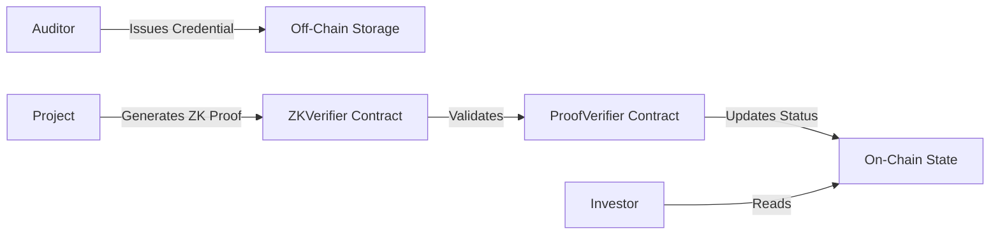

# 🔐 Polverify
### Privacy-Preserving Audit Verification Layer for Polygon Mainnet

**Prove your smart contracts have been audited without revealing sensitive report details**

[Live Demo](https://zk-verify.vercel.app) • [Discovery](#-discovery) • [Architecture](#-architecture) • [Features](#-key-features)

---

## 🚀 Live on Polygon Mainnet

Polverify is fully deployed and operational on the Polygon Mainnet.

### Contract Addresses
| Contract | Address | Explorer |
|----------|---------|----------|
| **AuditorRegistry** | `0x811969acFaC9bF1B8E3742B786d492227b160400` | [View on PolygonScan](https://polygonscan.com/address/0x811969acFaC9bF1B8E3742B786d492227b160400) |
| **ProofVerifier** | `0x4f1Fb45b8F1BE945d5f76df05F92c1810c027663` | [View on PolygonScan](https://polygonscan.com/address/0x4f1Fb45b8F1BE945d5f76df05F92c1810c027663) |
| **ZKVerifier** | `0x39d003c748CAE756F11a0C4C702c0b70d2523457` | [View on PolygonScan](https://polygonscan.com/address/0x39d003c748CAE756F11a0C4C702c0b70d2523457) |

- **Network:** Polygon Mainnet
- **Chain ID:** 137
- **Native Token:** POL / MATIC

---

## 🌟 Overview

Polverify is a production-ready protocol that enables **privacy-preserving audit verification** on Polygon. Auditors issue verifiable credentials, projects generate zero-knowledge proofs, and investors verify audit status—all while keeping sensitive vulnerability details private.

It solves a critical dilemma in Web3 security: **How do you prove you've been audited without showing the report that contains the vulnerabilities?**

### ✨ Key Features

🔐 **Privacy-Preserving Verification**
Prove audit completion without exposing specific vulnerabilities or full reports. Uses Zero-Knowledge proofs to validate attestations.

⛓️ **On-Chain Truth**
All verifications are anchored on-chain. Smart contracts cryptographically validate the proofs, ensuring that the audit status is immutable and trustless.

🎯 **Auditor Reputation System**
A built-in trust layer that aggregates reputation scores from major platforms like GitHub, Code4rena, and Immunefi. Know exactly who audited the project.

📊 **Real-Time Transparency**
Live dashboards showing proof generation latency, verification gas usage, and auditor activity.

🛡️ **Sybil Resistance**
Strict auditor onboarding and verification process via admin governance and reputation scoring.

---

## 🎯 Problem & Solution

### The Problem
- **Sensitive Data:** Audit reports contain "how-to-hack" instructions for vulnerabilities.
- **Trust Gap:** Projects say "Audited by X", but users can't verify it without seeing the PDF.
- **fragmentation:** No standardized way to verify auditor credentials or track their reputation.

### Our Solution
Polverify introduces a **Zero-Knowledge verification layer**:
1. **Auditors** issue a cryptographic credential summarizing the audit.
2. **Projects** generate a ZK proof that they hold a valid credential from an approved auditor.
3. **Smart Contracts** verify this proof on-chain.
4. **Users** see a "Verified" badge on the blockchain without ever seeing the PDF.

---

## 🏗️ Architecture

### Smart Contracts (Solidity 0.8.20)

#### 📋 AuditorRegistry.sol
The source of truth for auditor identity.
- Manages approved auditors.
- Stores aggregated reputation scores (0-100).
- Tracks credential issuance history.

#### 🔐 ZKVerifier.sol
The cryptographic backbone.
- Validates EIP-191 signatures and ZK proof attestations.
- Prevents proof replay attacks.
- optimized for low gas consumption (~285k gas/verification).

#### ✅ ProofVerifier.sol
The coordination layer.
- Anchors verification status to project addresses.
- Links auditors to projects on-chain.
- Emits verification events for indexers.

---

## 📖 Documentation & Flows

### System Flow

#### 1️⃣ Auditor Onboarding
Auditors apply and are vetted. Once approved, their reputation score is calculated based on their track record (Code4rena, Immunefi, GitHub) and stored on-chain.

#### 2️⃣ Credential Issuance
When an audit is complete, the Auditor signs a structured data packet (AIR Kit Credential). This hash anchors the audit result.

#### 3️⃣ Proof Generation
The project generates a proof using the backend service. This proof confirms:
- "I have a credential from Auditor X"
- "Auditor X is valid in the Registry"
- "The audit covers this specific contract address"

#### 4️⃣ Public Verification
Anyone can query the `ProofVerifier` contract. If the proof is valid, the contract returns `isVerified: true` and the timestamp.

---

## 🔒 Security

Polverify is built with security first:
- **EIP-712 / EIP-191 Signatures:** strictly typed data signing.
- **Replay Protection:** Nonces and unique proof identifiers.
- **Access Control:** Role-based permissions for registry management.
- **Gas Optimization:** Efficient storage layouts and calldata usage.

---

## 🌐 Live Resources

- **Frontend:** [https://zk-verify.vercel.app](https://zk-verify.vercel.app)
- **Backend API:** [https://polverify-backend.onrender.com](https://polverify-backend.onrender.com)
- **Explorer:** [https://polygonscan.com](https://polygonscan.com)

---

## 📜 License

This project is licensed under the **MIT License**.

---

## 📞 Contact

